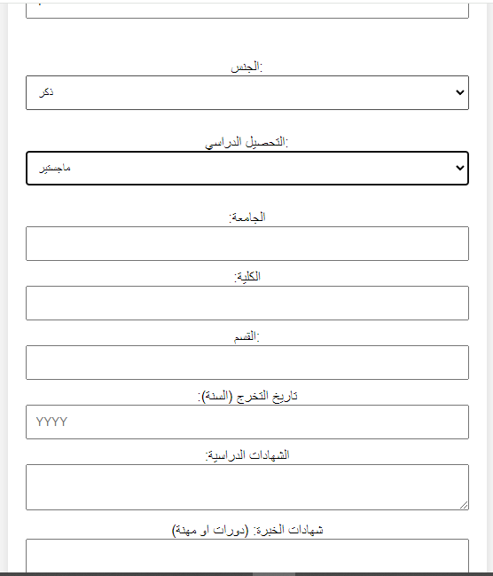
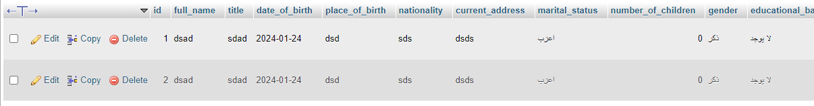

## معلومات 
عدل ملف (process.php)
و اضاف رابط السيرفر و الاسم المستخدم و كلمة المرور و اسم قواعد البيانات

اضف قواعد البيانات لتفتح لك جداول تلقائيا 

التصميم متجاوب اذا اختار متزوج سوف يفتح له خانة عدد الاطفال و كذلك التحصيل الدراسي

